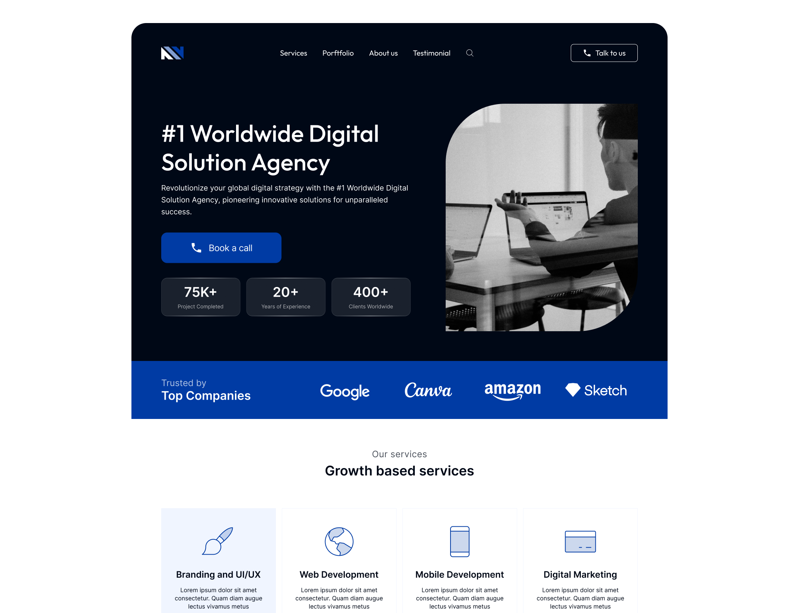

# Navytech - Landing Page
Neste estudo de caso pude codificar o protótipo da landing page Navytech e aplicar algumas abordagens práticas como **mobile first**, **perfect pixel** e **design responsivo**.

## Landing Page - Preview

- Projeto - **[Figma](https://www.figma.com/community/file/1349203071340277781)**
- Resultado - **[Navytech](https://mateusdmc.github.io/Navytech/)**

## Features
O desenvolvimento deste projeto foi realizado com as seguintes ferramentas e tecnologias:
- **HTML5**: Estruturação semântica do conteúdo.
- **CSS**: Estilização e apresentação visual.
- **JavaScript**: Implementação da lógica interativa e dinâmica do projeto.
- **Tailwind CSS**: Framework utilitário para um desenvolvimento de design rápido e responsivo.
- **Node/NPM**: Gerenciamento de dependências e automação de tarefas do projeto.
